# Fun with Python for Geodata
Personal practices in geodata analysis with python.

[1. Data Visulization](#1-data-visulization)

- [1.1 covid-19 and Benford's law](#11-covid-19-and-benfords-law)
- [1.2 data visualization exercise](#12-data-visualization-exercise])
    - [1.2.1 Global Annual Temperature Anomaly Interactive scatter plots with lowess trendlines](#121-global-annual-temperature-anomaly-interactive-scatter-plots-with-lowess-trendlines)
    - [1.2.2 COVID-19 related spatial visualization](#122-covid-19-related-spatial-visualization) (time slider map, ridgeline plot, multi tooltip graph)
    - [1.2.3 Time series plots](#123-time-series-plots) (drought, glaicer massbalance)
    - [1.2.4 Mapping the World](#124-mapping-the-world) (global airport connection, power plant)
- [1.3 Raster Data Visualization](#13-raster-data-visualization)
    - [1.3.1 Interactive DEM viewer and flood model](#131-interactive-dem-viewer)

[2. Automation](#2-automation)
- [2.1 EarthdataDownload.py](#21-earthdatadownloadpy)
- [2.2 mosaic.py](#22-mosaicpy)

[3. geopyfsn](#3-geopyfsn)
## 1. Data Visulization

### 1.1 [covid-19 and Benford's law](https://github.com/fsn1995/Fun-with-Python-for-Geodata/blob/master/dataVisualization/covid19Benford.ipynb)
Benford's law is an interesting theory so I did some experiment with covid-19 data. It's out of my specialization so there's no gurantee in the accuracy and quality of this analysis. Be doubtful and just for fun.
Here the screenshot is confirmed cases from three countries that I had lived. 


Note: After made the first test in April, I later found a correspondence article that support my assumption in May. (*Sambridge, M. and Jackson, A., 2020. National COVID numbers-Benford's law looks for errors. Nature, 581(7809), pp.384-384. doi: [10.1038/d41586-020-01565-5](https://www.nature.com/articles/d41586-020-01565-5)*).
### 1.2 **data visualization exercise** [part1]((https://nbviewer.jupyter.org/github/fsn1995/Fun-with-Python-for-Geodata/blob/master/dataVisualization/DataVisual.ipynb))
Scripts or jupyter notebooks for processing, visualizing and analyzing data.Some are exported as interactive html files in [**dataVisualization**](https://github.com/fsn1995/Fun-with-Python-for-Geodata/tree/master/dataVisualization/dataVisualHTML) folder or for preview in the links given.  

The [raw ipynb file](https://github.com/fsn1995/Fun-with-Python-for-Geodata/blob/master/dataVisualization/DataVisual.ipynb) contains contents of custom JavaScript plots will be rendered as static html (see [GitHub help](https://help.github.com/en/github/managing-files-in-a-repository/working-with-jupyter-notebook-files-on-github)), same for exported html files. 

Interactive figures or maps for:
#### 1.2.1 Global Annual Temperature Anomaly Interactive scatter plots with lowess trendlines
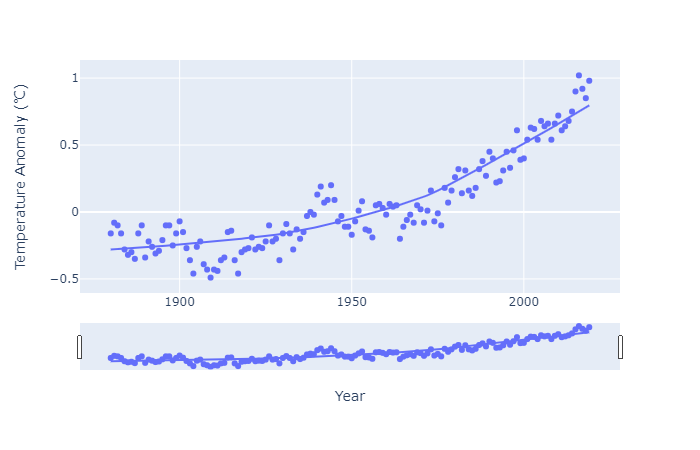

#### 1.2.2 COVID-19 related spatial visualization
- [**COVID 19 Daily New Deaths per Million with Time Slider**](https://nbviewer.jupyter.org/github/fsn1995/Fun-with-Python-for-Geodata/blob/master/dataVisualization/dataVisualHTML/covid19deaths.html)

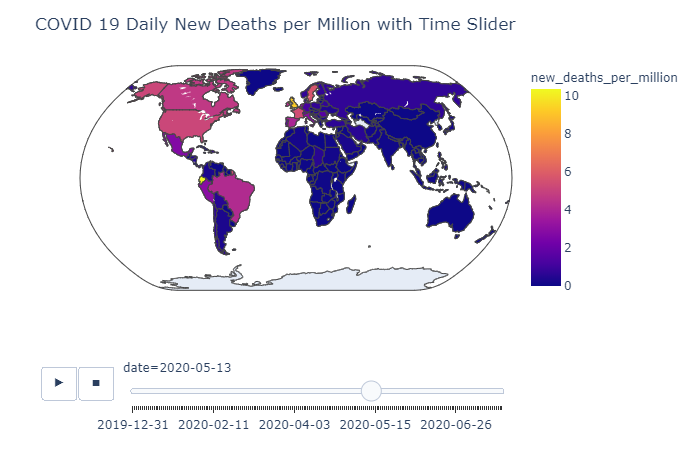

- [**Comparison of COVID-19 Case Growth and Government Response Stringency Index**](https://nbviewer.jupyter.org/github/fsn1995/Fun-with-Python-for-Geodata/blob/master/dataVisualization/dataVisualHTML/covidpolicy.html)

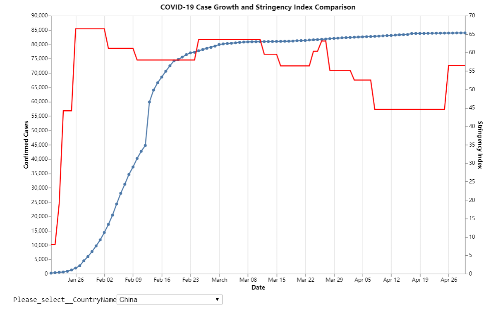

- **Ridgeline Plot of COVID-19 Daily Cases**  
[New Cases](https://nbviewer.jupyter.org/github/fsn1995/Fun-with-Python-for-Geodata/blob/master/dataVisualization/dataVisualHTML/covidNewCaseRidge.html) | [New Deaths](https://nbviewer.jupyter.org/github/fsn1995/Fun-with-Python-for-Geodata/blob/master/dataVisualization/dataVisualHTML/covidNewDeathRidge.html)

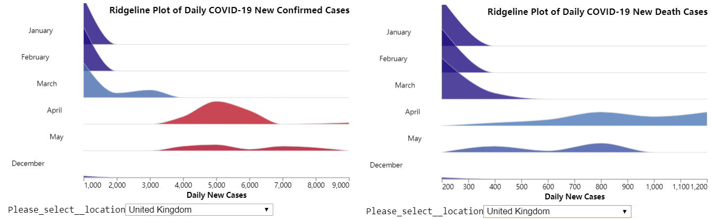

- **[Multi-line Tooltip of COVID-19 daily new cases per million by continents](https://nbviewer.jupyter.org/github/fsn1995/Fun-with-Python-for-Geodata/blob/master/dataVisualization/dataVisualHTML/covid19continent.html)**
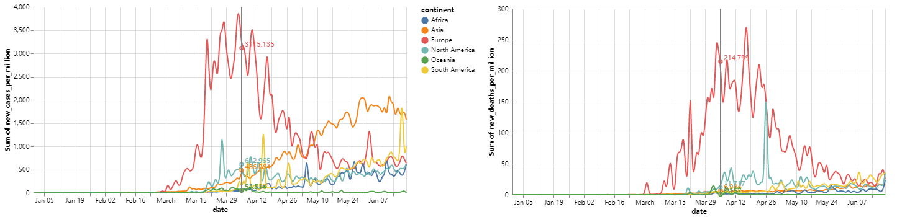

#### 1.2.3 Time series plots
- **Time series bubble plots**


- **time series heatmap of drought condition**

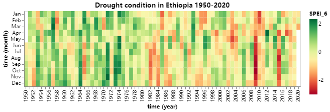

- **Mass Balance of Storglaciären**

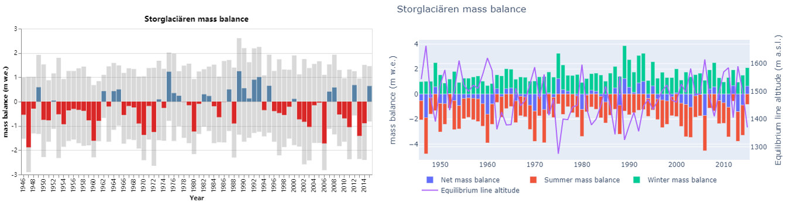
#### 1.2.4 Mapping the World
- [**Global Airports Connection Interactive Map**](https://nbviewer.jupyter.org/github/fsn1995/Fun-with-Python-for-Geodata/blob/master/dataVisualization/dataVisualHTML/airportConnection.html), inspired by altair template and OpenFlights.org. 

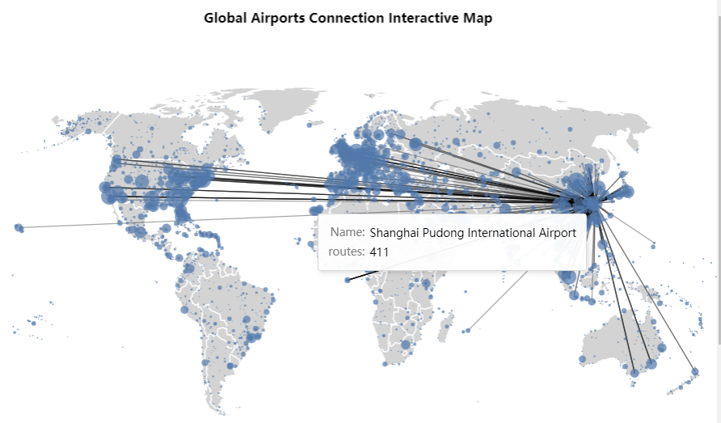

- [**Global Power Plant**](https://nbviewer.jupyter.org/github/fsn1995/Fun-with-Python-for-Geodata/blob/master/dataVisualization/dataVisualHTML/globalpowerplant.html), mixed subplots treemaps with plotly. 

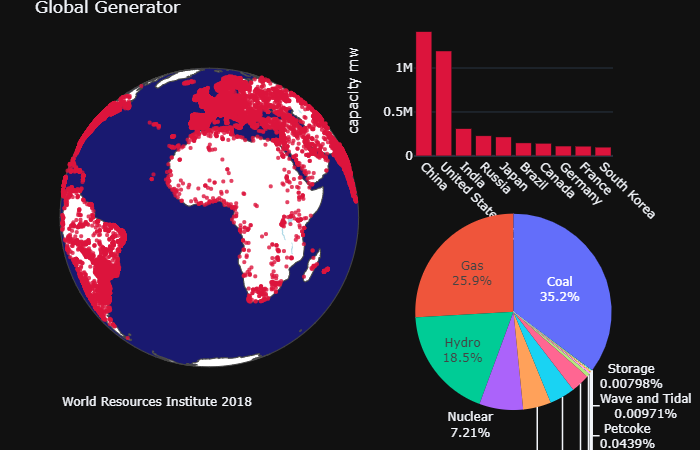
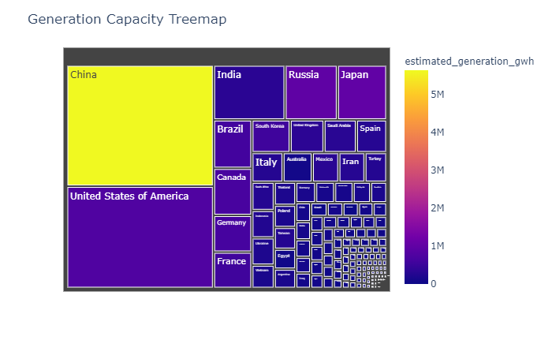

### 1.3 [Raster Data Visualization](https://nbviewer.jupyter.org/github/fsn1995/Fun-with-Python-for-Geodata/blob/master/dataVisualization/georasterVisual.ipynb)
#### 1.3.1 [Interactive DEM viewer](https://nbviewer.jupyter.org/github/fsn1995/Fun-with-Python-for-Geodata/blob/master/dataVisualization/dataVisualHTML/dem3d.html)

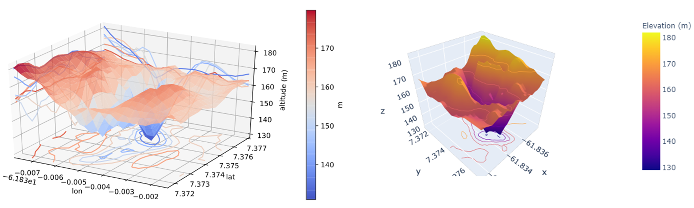
rapid flood spreading method (RFSM) practice
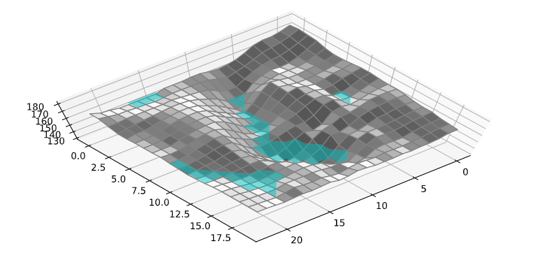

## 2. Automation
### 2.1 [EarthdataDownload.py](https://github.com/fsn1995/Fun-with-Python-for-Geodata/blob/master/automation/EarthdataDownload.py)
This is used to bulk download data from earthdata.nasa.gov. Input required is the link list.
### 2.2 [mosaic.py](https://github.com/fsn1995/Fun-with-Python-for-Geodata/blob/master/automation/mosaic.py)
This is practice to do mosaic and subset by roi for geotiff data. The process is done with rasterio library.

## 3. [geopyfsn](https://github.com/fsn1995/Fun-with-Python-for-Geodata/blob/master/dataVisualization/geopyfsn.py)
This is a collection of some functions used for myself.
- getxy: This can be used to obtain the x, y coordinates of a tiff file.

```python
import rasterio 
from geopyfsn import getxy

src = rasterio.open('image.tif')
x, y = getxy(src)
```
### 