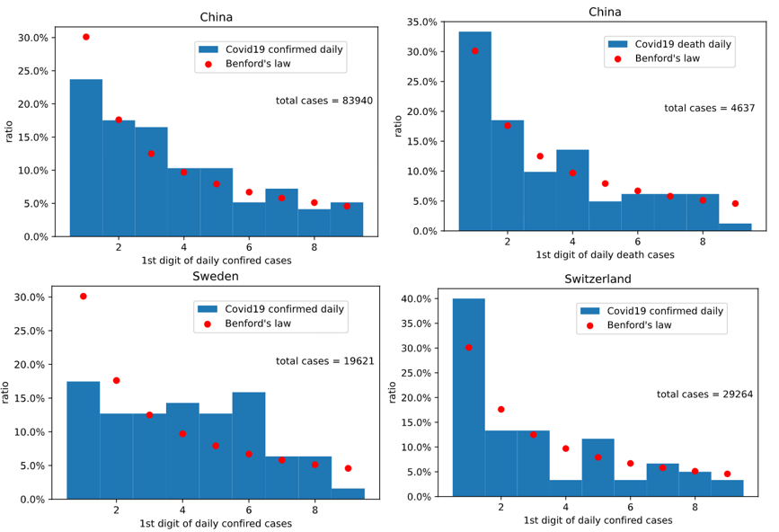

# Fun with Python for Geodata
Some tools needed by myself in study. Descriptions will be given in the script.
1. [EarthdataDownload.py](https://github.com/fsn1995/Fun-with-Python-for-Geodata/blob/master/EarthdataDownload.py)
This is used to bulk download data from earthdata.nasa.gov. Input required is the link list.
2. [mosaic.py](https://github.com/fsn1995/Fun-with-Python-for-Geodata/blob/master/mosaic.py)
This is practice to do mosaic and subset by roi for geotiff data. The process is done with rasterio library.
3. [time serie plots](https://github.com/fsn1995/Fun-with-Python-for-Geodata/blob/master/timeSeriesVegetation.ipynb)
It's a practice to do simple time series plots of EVI data exported from GEE. It will fill data gaps, apply moving average filter, detrend and make boxplots. 
4. landcover change analysis [.py](https://github.com/fsn1995/Fun-with-Python-for-Geodata/blob/master/landcover.py) [ipynb](https://github.com/fsn1995/Fun-with-Python-for-Geodata/blob/master/landcoverchange.ipynb)
This is a practice for post-processing the exported landcover classification. It will plot the time series landcover and its changes. The lucc transition will also be recorded. Pie charts and scatter plots are made to see the trend of different classes of landcover.
5. [covid-19 and Benford's law](https://github.com/fsn1995/Fun-with-Python-for-Geodata/blob/master/covid19Benford.ipynb)
Benford's law is an interesting theory so I did some experiment with covid-19 data. It's out of my specialization so there's no gurantee in the accuracy and quality of this analysis. Be doubtful and just for fun.
Here the screenshot is confirmed cases from three countries that I had lived. 
    