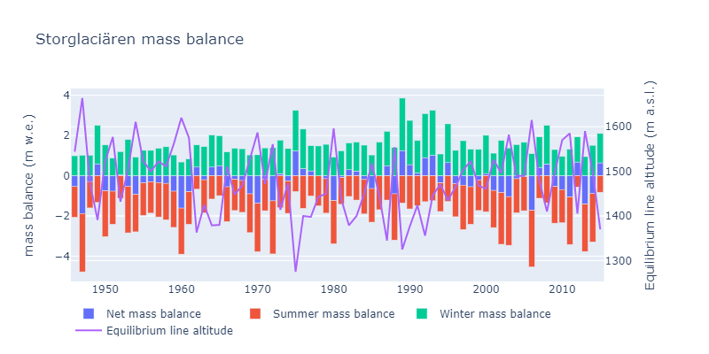

# Fun with Python for Geodata
Personal practices in geodata analysis with python.
## 1. Data Visulization
Scripts or jupyter notebooks for processing, visualizing and analyzing data.
### 1.1 [covid-19 and Benford's law](https://github.com/fsn1995/Fun-with-Python-for-Geodata/blob/master/covid19Benford.ipynb)
Benford's law is an interesting theory so I did some experiment with covid-19 data. It's out of my specialization so there's no gurantee in the accuracy and quality of this analysis. Be doubtful and just for fun.
Here the screenshot is confirmed cases from three countries that I had lived. 
    
### 1.2 [data visualization](https://github.com/fsn1995/Fun-with-Python-for-Geodata/blob/master/dataVisualization/DataVisual.ipynb)
Interactive figures or maps for:
1) Global Annual Temperature Anomaly Interactive scatter plots with lowess trendlines
2) COVID-19 related spatial visualization

   
3) Time series plots
- Time series bubble plots

- time series heatmap of drought condition

- Mass Balance of Storglaciären

## 2. Automation
### 2.1 [EarthdataDownload.py](https://github.com/fsn1995/Fun-with-Python-for-Geodata/blob/master/automation/EarthdataDownload.py)
This is used to bulk download data from earthdata.nasa.gov. Input required is the link list.
### 2.2 [mosaic.py](https://github.com/fsn1995/Fun-with-Python-for-Geodata/blob/master/automation/mosaic.py)
This is practice to do mosaic and subset by roi for geotiff data. The process is done with rasterio library.
